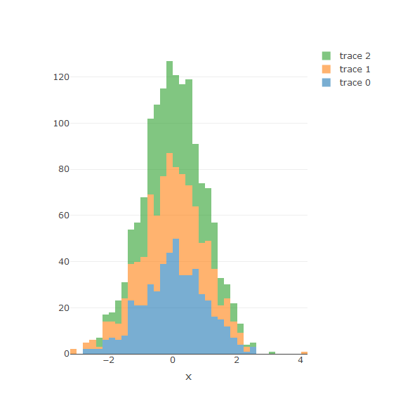

Plotly Presentation
========================================================
author:Vivek Singh 
date: 16-08-2020
autosize: true

Welcome to the presentation
========================================================

- This is a detailed presentation on how to create histogram plots using plotly 
- This presentiation shows how to include more than one type of histogram in a single plot 
- alpha used for this purpose is 0.6

Slide With Plot
========================================================

